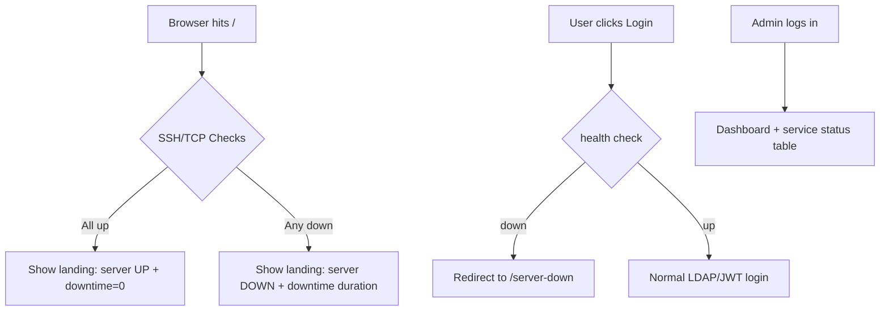

# Plan: Landing Page + SSH-Based Health Checks

## Goal
Add a public landing page at `/` with a red/white/black Esprit-themed design, a server uptime indicator, and auth gating that blocks login when dependent services/containers are down. Admins see a detailed per-service breakdown in addition to the status summary.

## Affected Routes / Behavior
| Route | Current behavior | New behavior |
|---|---|---|
| `/` | Redirects to `/login` | Serves `landing.html` |
| `/login` | Always allows login | Redirects to `server_down.html` if any dependency is down |
| `/dashboard`, `/request`, `/reservation/{id}`, `/admin` | Always allow access if authenticated | Redirect to `server_down.html` if dependencies are down |
| `/admin` | Shallow "pending" list | Adds per-service status table for admins (MySQL, LDAP, Slurm REST, munge, slurmctld, slurmd, DB container, LDAP container) |

## New Files
- `templates/landing.html` — public landing page
- `templates/server_down.html` — shown when dependencies are down
- `vm_monitor.py` — SSH health check module

## Modified Files
- `config.py` — add SSH and service-controller config
- `main.py` — add `/` route, `server_down.html` route, dependency-checking middleware / dependency, admin detail endpoint or template context
- `templates/dashboard.html` — admin section gets service status table (optional)

## Config Additions
```python
VM_HOST = "192.168.74.171"   # already matches services
VM_SSH_USER = "..."          # UNRESOLVED
VM_SSH_KEY_PATH = "..."      # UNRESOLVED
```

Proposed health targets:
- **TCP probes**: LDAP `:389`, MySQL `:3306`, Slurm REST `:6820`
- **SSH / systemd**: `slurmrestd`, `slurmctld`, `slurmd`, `munge`
- **SSH / docker**: DB container, LDAP container

## Downtime Tracking
- Maintain an in-memory (module-level) `first_failure: datetime | None` in `vm_monitor.py`.
- On each health check success → `first_failure = None`.
- On any failure and `first_failure is None` → set `first_failure = now`.
- Landing page computes uptime/downtime from this timestamp.

## Flow


## Risk / Trade-offs
- Polling SSH on every request is slow. Solution: cache result for N seconds (e.g., 30-60s) in a module-level variable on the FastAPI app state or `lru_cache`.
- SSH key must be readable by the FastAPI process user. We should NOT store passwords in `.env`; prefer key-based auth.
- If the VM itself is unreachable (SSH timeout), all dependent services are treated as down.

## One Unresolved Question
**What is the SSH username and auth method for the VM at `192.168.74.171`?**

Recommended answer: use key-based auth with a dedicated service account (e.g., `hpcadmin` or `ubuntu`), store only the private key path in `.env` / `config.py`, and do not store a password. If you want, I can also include a short "setup SSH key" checklist in the plan so you can configure it on the VM before implementing.
